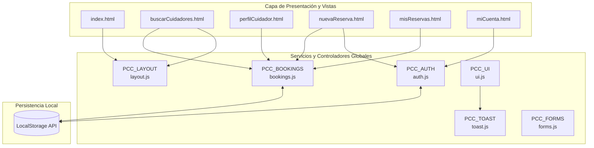

#  Pet CareConnect

> **Plataforma Web Integral para la Reserva y Gestión de Servicios Profesionales de Cuidado de Mascotas en Ecuador.**

[](https://developer.mozilla.org/es/docs/Web/HTML)
[](https://developer.mozilla.org/es/docs/Web/CSS)
[](https://developer.mozilla.org/es/docs/Web/JavaScript)
[](https://developer.mozilla.org/es/docs/Web/API/Window/localStorage)
[](https://css-tricks.com/)
[](https://www.w3.org/WAI/standards-guidelines/aria/)

---

##  Tabla de Contenidos

1. [Descripción del Proyecto](#-descripción-del-proyecto)
2. [Características Principales](#-características-principales)
3. [Estructura del Proyecto](#-estructura-del-proyecto)
4. [Arquitectura y Módulos de JavaScript](#-arquitectura-y-módulos-de-javascript)
5. [Modelos de Datos y Persistencia](#-modelos-de-datos-y-persistencia)
6. [Flujos de Usuario y Navegación](#-flujos-de-usuario-y-navegación)
7. [Diseño, Estilos y UI/UX](#-diseño-estilos-y-uiux)
8. [Instalación y Guía de Ejecución](#-instalación-y-guía-de-ejecución)
9. [Accesibilidad y Buenas Prácticas](#-accesibilidad-y-buenas-prácticas)
10. [Hoja de Ruta (Roadmap Futuro)](#-hoja-de-ruta-roadmap-futuro)
11. [Créditos y Licencia](#-créditos-y-licencia)

---

##  Descripción del Proyecto

**Pet CareConnect** es una aplicación web frontend completa, moderna y responsiva diseñada para conectar a dueños de mascotas con cuidadores profesionales y certificados en ciudades principales del Ecuador (*Quito, Guayaquil, Cuenca*).

El sistema permite a los usuarios:
- Explorar perfiles verificados de cuidadores con precios y calificaciones.
- Configurar y reservar servicios específicos (paseos, hospedaje/alojamiento, guardería, peluquería, cuidados médicos).
- Realizar cálculos en tiempo real de tarifas e impuestos de servicio.
- Gestionar reservas activas, pasadas y canceladas con opción de reprogramación o cancelación asistida.
- Administrar el perfil de usuario, múltiples mascotas con detalles médicos/conductuales y métodos de pago.

Toda la aplicación opera mediante una arquitectura cliente modular con persistencia reactiva en `localStorage`, permitiendo una experiencia interactiva inmediata y fluida sin requerir un backend externo para su funcionamiento demostrativo.

---

##  Características Principales

###  1. Autenticación y Gestión de Sesión
- **Inicio de Sesión (`login.html` / `login.js`):** Validación en tiempo real de credenciales, conmutador de visibilidad de contraseña y manejo de sesión activa.
- **Registro de Usuarios (`registro.html` / `registro.js`):** Validación de campos obligatorios, contraseñas seguras y términos de servicio.
- **Recuperación de Contraseña (`recuperarPassword.html` / `recuperarPassword.js`):** Flujo guiado de recuperación mediante correo electrónico.
- **Persistencia y Estado Global:** Módulo centralizado `PCC_AUTH` para autenticación y sincronización de barras de navegación.

###  2. Exploración y Búsqueda de Cuidadores
- **Directorio Dinámico (`buscarCuidadores.html` / `buscarCuidadores.js`):** Búsqueda por nombre, servicio o ubicación (ej. *La Carolina, Urdesa, Cumbayá, Samborondón*).
- **Filtros Interactivos:** Filtrado por ciudad, tipo de servicio, rango de tarifas y disponibilidad.
- **Tarjetas de Cuidadores:** Insignias de verificación, valoración en estrellas (1 a 5), recuento de opiniones, insignias de favoritos y acceso al perfil detallado.
- **Perfil Completo del Cuidador (`perfilCuidador.html` / `perfilCuidador.js`):**
  - Biografía profesional, certificaciones y especialidades.
  - Galería de fotos del entorno y áreas de juego.
  - Desglose de tarifas por tipo de servicio (noche, día, paseo).
  - Reseñas verificadas de clientes.
  - Widget lateral para reserva directa conectando al flujo de reserva.

###  3. Catálogo de Servicios
- **Vista de Servicios (`servicios.html`):** Detalle exhaustivo de las modalidades de atención:
  - **Paseos Diarios:** Paseos recreativos con seguimiento y reportes de actividad.
  - **Alojamiento / Hospedaje:** Estancia nocturna en hogares cálidos y certificados.
  - **Guardería de Día:** Socialización y juegos supervisados durante la jornada laboral.
  - **Peluquería y Spa:** Baño, corte higiénico y estética canina/felina.
  - **Cuidados Especiales:** Administración de fármacos y atención postoperatoria veterinaria.

###  4. Motor de Reservas Inteligente
- **Formulario Interactivo (`nuevaReserva.html` / `nuevaReserva.js` y `reservar.html` / `reservar.js`):**
  - Selección visual del cuidador y servicio.
  - Selector de fechas de entrada (*Check-in*) y salida (*Check-out*) con validaciones de fechas pasadas e intervalos coherentes.
  - Selección de mascota registrada o configuración de múltiples mascotas.
  - **Calculadora en Tiempo Real:** Subtotal automático según duración (días/noches/paseos) + tarifa de servicio de la plataforma = Total final transparente.
  - Campo para notas especiales y requerimientos alimenticios/médicos.
- **Pantalla de Confirmación (`reservaConfirmada.html` / `reservaConfirmada.js`):**
  - Resumen visual con código único de reserva (ej. `#PCC-8421`), estado inicial y accesos rápidos.

###  5. Dashboard de "Mis Reservas"
- **Gestión Integral (`misReservas.html` / `misReservas.js`):**
  - Pestañas de filtrado: *Todas*, *Activas / Próximas*, *Completadas* y *Canceladas*.
  - **Modal de Detalle Completo:** Inspección de estado, cuidador asignado, fechas, mascota asociada, desglose de pago y notas.
  - **Reprogramación de Fechas:** Actualización dinámica de fechas con recálculo de días.
  - **Cancelación Segura:** Diálogo modal de confirmación (`confirmacionModal.js`) con advertencias y política de reembolso.

###  6. Perfil de Usuario y Gestión de Mascotas
- **Mi Cuenta (`miCuenta.html` / `account.js`):**
  - **Datos del Dueño:** Edición de nombre, teléfono, correo, ubicación y avatar.
  - **CRUD de Mascotas:** Registro, edición y eliminación de mascotas (Nombre, Tipo, Raza, Edad, Peso, Género, Notas médicas/alérgicas e iconos).
  - **CRUD de Métodos de Pago:** Añadir tarjetas (Visa, Mastercard, Débito/Crédito), asignar tarjeta predeterminada y eliminación segura.
  - **Preferencias y Notificaciones:** Ajustes de notificaciones por correo y SMS.

###  7. Sistema de Notificaciones y Modales Accesibles
- **Notificaciones Toast (`toast.js`):** Mensajes emergentes no invasivos con alertas de éxito, información, advertencia y error.
- **Gestor de Modales (`ui.js` / `confirmacionModal.js`):** Control de foco (*Focus Trap*), cierre por teclado (`Escape`) y fondo bloqueado accesible.
- **Barra de Navegación y Pie Dinámicos (`layout.js`):** Inyección uniforme de Header, Footer, navegación móvil y modales legales (*Contacto, Privacidad, Términos, FAQ*) en todas las páginas.

---

##  Estructura del Proyecto

```plaintext
proyectoRda3/
│
├── README.md                           # Documentación técnica general del proyecto
│
└── petCareConnect/                     # Raíz de la aplicación web
    │
    ├── index.html                      # Página principal / Landing page con Bento Grid
    │
    ├── assets/                         # Recursos multimedia y estáticos
    │   └── images/                     # Fotografías de cuidadores, mascotas y ambientes
    │       ├── ana.jpg
    │       ├── carlos.jpg
    │       ├── elena.jpg
    │       ├── estancia.jpg
    │       ├── guarderia.jpeg / .webp
    │       ├── inicio.jpg
    │       ├── javier.jpg
    │       ├── lucia.jpg
    │       ├── mas.jpg
    │       ├── otros.jpg
    │       ├── paseo.jpg
    │       ├── paw.png                 # Favicon institucional
    │       ├── salon_amplio.jpg
    │       ├── sofia.jpg
    │       ├── terraza.jpg
    │       └── zona_limpia.jpg
    │
    ├── css/                            # Hojas de estilo en cascada
    │   └── styles.css                  # Sistema de diseño global, variables y componentes
    │
    ├── js/                             # Módulos y controladores JavaScript ES6+
    │   ├── account.js                  # Lógica de gestión de perfil, mascotas y métodos de pago
    │   ├── auth.js                     # Estado de autenticación, usuarios, mascotas y pagos por defecto
    │   ├── bookings.js                 # Directorio de cuidadores, seed data y CRUD de reservas
    │   ├── buscarCuidadores.js         # Lógica de búsqueda, filtrado y favoritos
    │   ├── confirmacionModal.js        # Modales de confirmación para acciones críticas
    │   ├── customSelect.js             # Componente de selector desplegable personalizado y accesible
    │   ├── forms.js                    # Validaciones de formularios, sanitización y errores en línea
    │   ├── layout.js                   # Renderizado dinámico de Header, Footer y Modales globales
    │   ├── login.js                    # Controlador de inicio de sesión
    │   ├── misReservas.js              # Controlador del dashboard de reservas del usuario
    │   ├── nuevaReserva.js             # Lógica de creación de reserva y calculadora de tarifas
    │   ├── perfilCuidador.js           # Renderizado dinámico del perfil individual de cuidadores
    │   ├── recuperarPassword.js        # Controlador del flujo de recuperación de contraseña
    │   ├── registro.js                 # Controlador del formulario de registro
    │   ├── reservaConfirmada.js        # Vista de éxito y detalles de orden confirmada
    │   ├── reservar.js                 # Flujo alternativo de reserva guiada
    │   ├── toast.js                    # Notificaciones toast flotantes accesibles
    │   └── ui.js                       # Utilidades de interfaz, accesibilidad y modales
    │
    └── pages/                          # Vistas secundarias de la aplicación
        ├── buscarCuidadores.html       # Directorio y filtros de cuidadores
        ├── login.html                  # Formulario de inicio de sesión
        ├── miCuenta.html               # Panel de control de usuario, mascotas y pagos
        ├── misReservas.html            # Historial y gestión de reservas
        ├── nuevaReserva.html           # Asistente de reserva y cálculo de cotización
        ├── perfilCuidador.html         # Ficha técnica y reseñas del cuidador
        ├── recuperarPassword.html      # Recuperación de cuenta
        ├── registro.html               # Formulario de registro de nuevos usuarios
        ├── reservaConfirmada.html      # Confirmación y voucher de reserva
        ├── reservar.html               # Vista de reserva rápida
        └── servicios.html              # Catálogo detallado de servicios y tarifas base
```

---

##  Arquitectura y Módulos de JavaScript

La lógica de frontend está organizada mediante un patrón de **Namespaces Globales** reutilizables y desacoplados:



### Detalle de Módulos Principales:

| Módulo | Archivo | Responsabilidad Principal |
| :--- | :--- | :--- |
| **`PCC_AUTH`** | `auth.js` | Gestiona el estado de sesión (`pcc_logged_in`), perfil del usuario, CRUD de mascotas (`pcc_pets`) y tarjetas de pago (`pcc_payments`). |
| **`PCC_BOOKINGS`** | `bookings.js` | Almacena el catálogo de cuidadores certificados, el historial de reservas (`pcc_bookings`), cálculo de tarifas y cambios de estado. |
| **`PCC_LAYOUT`** | `layout.js` | Determina la ruta activa, inyecta la cabecera responsiva con búsqueda, footer con modales informativos y navegación móvil inferior. |
| **`PCC_UI`** | `ui.js` | Provee apertura y cierre accesible de modales con captura de foco y restauración tras cierre. |
| **`PCC_TOAST`** | `toast.js` | Dispara notificaciones visuales flotantes con temporizador de auto-destrucción y soporte ARIA live. |
| **`PCC_FORMS`** | `forms.js` | Valida reglas de negocio en campos de entrada, aplica clases de error y limpia alertas dinámicamente. |

---

##  Modelos de Datos y Persistencia

La aplicación almacena su información en el navegador usando la **LocalStorage API**. Si no existen registros previos, los módulos cargan automáticamente datos de prueba (*seed data*):

### 1. Usuario (`pcc_user`)
```json
{
  "name": "Gabriel Flor",
  "email": "gabriel.flor@gmail.com",
  "phone": "+593 96 931 7653",
  "location": "Quito, Ecuador",
  "memberSince": "Julio 2026",
  "avatar": "GF"
}
```

### 2. Mascota (`pcc_pets` - Array)
```json
{
  "id": "pet-1",
  "name": "Bruno",
  "type": "Perro",
  "breed": "Beagle",
  "age": "3 años",
  "weight": "14 kg",
  "gender": "Macho",
  "notes": "Medicación: gotas para ojos por la mañana. Alérgico al pollo.",
  "icon": "pets"
}
```

### 3. Método de Pago (`pcc_payments` - Array)
```json
{
  "id": "pay-1",
  "brand": "Visa",
  "last4": "4242",
  "expiry": "08/2028",
  "cardType": "Débito",
  "holder": "Gabriel Flor",
  "isDefault": true
}
```

### 4. Cuidador (`PCC_BOOKINGS.SITTERS` - Catálogo)
```json
{
  "id": "elena-martinez",
  "name": "Elena Martínez",
  "title": "Especialista en razas grandes y cuidado doméstico",
  "rating": 4.9,
  "reviewsCount": 48,
  "location": "Quito, La Carolina",
  "nationality": "Ecuatoriana",
  "country": "Ecuador",
  "pricePerNight": 25,
  "pricePerDay": 18,
  "pricePerWalk": 15,
  "verified": true,
  "avatar": "EM",
  "services": ["alojamiento", "guarderia", "paseos"]
}
```

### 5. Reserva (`pcc_bookings` - Array)
```json
{
  "id": "res-1",
  "code": "#PCC-8421",
  "sitterId": "elena-martinez",
  "sitterName": "Elena Martínez",
  "serviceId": "paseos",
  "serviceName": "Paseo diario",
  "petName": "Bruno",
  "startDate": "2026-08-30",
  "endDate": "2026-08-30",
  "status": "activa",
  "subtotal": 15.00,
  "serviceFee": 2.25,
  "total": 17.25,
  "notes": "Paseo por el parque La Carolina."
}
```

---

##  Flujos de Usuario y Navegación

### Flujo Principal de Contratación de un Servicio:

```
[ Inicio / Landing ]
       │
       ▼
[ Buscar Cuidadores ] ──(Filtra por ciudad / servicio)──► [ Perfil del Cuidador ]
       │                                                         │
       └─────────────────────────┬───────────────────────────────┘
                                 │
                                 ▼
                      [ Formulario de Reserva ]
                      - Selección de Mascota
                      - Fechas Check-in / Check-out
                      - Cálculo en Vivo de Tarifas
                                 │
                                 ▼
                     [ Confirmación de Reserva ]
                                 │
                                 ▼
                     [ Dashboard Mis Reservas ]
                      - Ver detalles completos
                      - Reprogramar fechas
                      - Cancelar con modal seguro
```

---

##  Diseño, Estilos y UI/UX

El diseño visual está construido desde cero en `css/styles.css` con un enfoque **moderno, elegante y minimalista**:

- **Bento Grid Layout:** Distribución visual en bloques asimétricos e interactivos inspirada en las mejores tendencias de diseño contemporáneo.
- **Glassmorphism & Profundidad:** Efectos de desenfoque de fondo (*backdrop-filter*), bordes sutiles y sombras multicapa suaves.
- **Tipografía:** [Inter de Google Fonts](https://fonts.google.com/specimen/Inter) para máxima legibilidad en todas las densidades de pantalla.
- **Iconografía:** [Google Material Symbols Outlined](https://fonts.google.com/icons) integrada semánticamente.
- **Micro-interacciones y Estados:** Transiciones fluidas en hover, focus visible accesible, feedback de botones y estados vacíos (*Empty States*) ilustrados.
- **Diseño Totalmente Responsivo:** Breakpoints adaptados para móviles (<768px), tablets (768px - 1024px) y pantallas grandes (>1024px).

---

##  Instalación y Guía de Ejecución

Al ser un proyecto desarrollado con tecnologías web estándar (HTML5, CSS3, JavaScript puro), no requiere procesos de compilación (*build steps*) ni instalación pesada de dependencias.

### Opción 1: Extensión Live Server (Recomendada en VSCode)
1. Abre la carpeta del proyecto en **Visual Studio Code**.
2. Instala la extensión **Live Server** (de *Ritwick Dey*).
3. Haz clic derecho sobre `petCareConnect/index.html` y selecciona **"Open with Live Server"**.
4. La aplicación se abrirá en `http://127.0.0.1:5500/petCareConnect/index.html`.

---

##  Accesibilidad y Buenas Prácticas

- **HTML Semántico:** Uso riguroso de `<main>`, `<header>`, `<footer>`, `<nav>`, `<section>`, `<article>`, `<aside>` y jerarquía lógica de encabezados (`<h1>` a `<h3>`).
- **Atributos ARIA:** `aria-label`, `aria-labelledby`, `aria-hidden`, `aria-modal="true"`, `aria-current="page"` y `role="dialog"`.
- **Navegación por Teclado:** Trampas de foco en modales, cierre con tecla `Escape`, y `tabindex` administrado.
- **Lectores de Pantalla:** Etiquetas accesibles con la clase `.sr-only` para elementos gráficos y botones de acción.
- **Validación Robusta:** Prevención de envío de formularios incompletos y mensajes de error asociados a los campos correspondientes.


---

##  Créditos y Licencia

Desarrollado como parte del proyecto académico y profesional de **Pet CareConnect** (2026).

Distribuido bajo la Licencia **MIT**. Consulta el código fuente para más detalles sobre su libre distribución y modificación.
